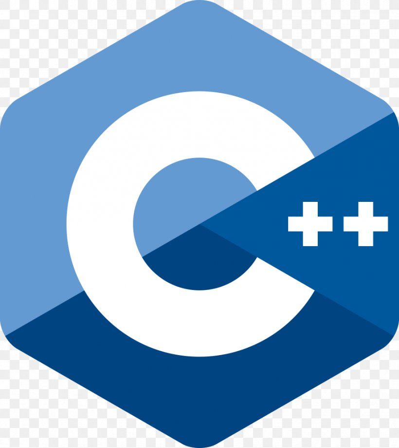

### Hi there 👋

**TheLogicalNights** 

- 🔭 I’m currently working on : Members-Community-Portal
- 🌱 I’m currently learning : Scala and Python
- 📫 How to reach me: https://www.instagram.com/ll_.swapnil._ll
- ⚡ LeetCode Profile : https://leetcode.com/TheLogicalNights/
<!--
 
[][website]
[][twitter]
[][linkedin]
[][instagram]
 
-->
### Languages and Tools:

 

 
 
- C
- C++
- Java
- HTML/HTML5
- CSS/CSS3
- JavaScript
- Bootstrap
- Git
- Terminal
- Visual Studio Code
- Sublime

